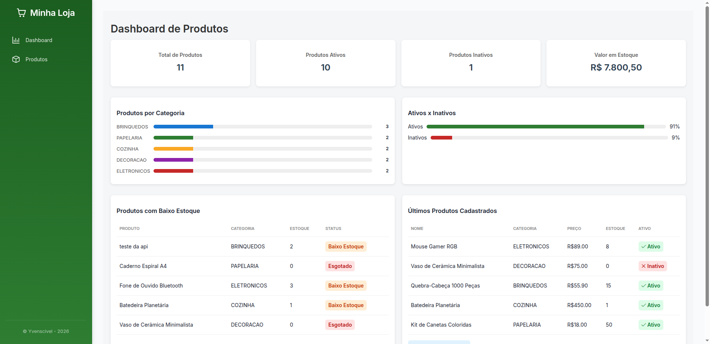
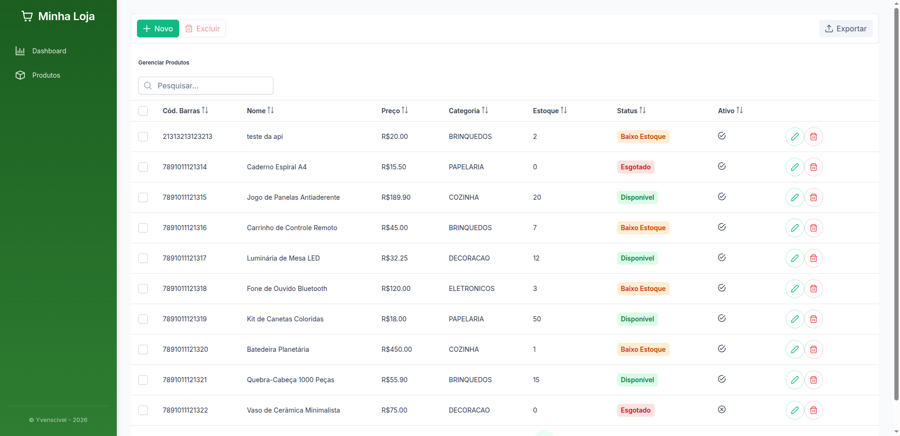

# 📦 Fullstack Java + Angular – CRUD Loja de Variedades

Projeto desenvolvido como **Desafio Técnico** para a vaga de **Bolsista – DRC Consultoria em TI**.

A aplicação consiste em um **CRUD de produtos** para uma **loja de variedades**, permitindo o gerenciamento de cadastro e estoque de produtos, com **front-end em Angular** e **back-end em Java Spring Boot**.

---

## 🌐 Aplicação em Produção (Deploy)

A aplicação está disponível online, com **front-end e back-end publicados em ambiente de produção**:

* **Front-end (Angular – Vercel)**
  🔗 [https://fullstack-java-angular-lojin-git-fc6084-yvens-projects-524ce555.vercel.app/?_vercel_share=a6VNR0RrrprSiEXpPMycMYAzzkO6AUCo](https://fullstack-java-angular-lojin-git-fc6084-yvens-projects-524ce555.vercel.app/?_vercel_share=a6VNR0RrrprSiEXpPMycMYAzzkO6AUCo)

* **Back-end (API Spring Boot – Render)**
  🔗 [https://api-projeto-loja.onrender.com/api/produtos](https://api-projeto-loja.onrender.com/api/produtos)

Esses ambientes permitem acessar e testar a aplicação sem necessidade de execução local.

---

## 🧩 Funcionalidades

* Cadastrar produtos
* Listar produtos
* Editar produtos
* Excluir produtos
* Filtro por categoria
* Busca por nome
* Paginação e ordenação
* Destaque para produtos com baixo estoque
* Cálculo do valor total em estoque
* Validação de dados no back-end
* Tratamento adequado de erros HTTP

---

## 📸 Screenshots

Aqui estão algumas telas da aplicação em funcionamento:

### Dashboard

<div align="center">
  
  <p><i>Visão geral e estatísticas do estoque na dashboard.</i></p>
</div>

### Listagem de Produtos

<div align="center">
  
  <p><i>Página com a listagem de todos os produtos, filtros e paginação.</i></p>
</div>

---

## 🛠️ Tecnologias Utilizadas

### 🔙 Back-end

* Java 17
* Spring Boot
* Spring Web (REST)
* Spring Data JPA
* Bean Validation
* PostgreSQL
* Maven

### 🖥️ Front-end

* Angular
* TypeScript
* PrimeNG
* HTML / CSS

### 🐳 Infraestrutura

* Docker
* Docker Compose

---

## 📂 Estrutura do Repositório

```
fullstack-java-angular/
│
├── backend/    → API REST em Spring Boot
├── frontend/   → Aplicação Angular
├── assets/     → Imagens de demonstração (Screenshots)
└── README.md
```

---

## ▶️ Como rodar o Back-end

### Pré-requisitos

* Java 17+
* Maven
* Docker e Docker Compose

### Passo a passo

1. Acesse a pasta do back-end:

```bash
cd backend
```

2. Suba o banco de dados com Docker Compose:

```bash
docker-compose up -d
```

3. Execute a aplicação:

```bash
mvn spring-boot:run
```

### 🔗 A API estará disponível em:

`http://localhost:8080`

---

## ▶️ Como rodar o Front-end

### Pré-requisitos

* Node.js
* Angular CLI

### Passo a passo

1. Acesse a pasta do front-end:

```bash
cd frontend
```

2. Instale as dependências:

```bash
npm install
```

3. Execute a aplicação:

```bash
ng serve
```

### 🔗 A aplicação estará disponível em:

`http://localhost:4200`

---

## 🔌 Endpoints principais da API

| Método | Endpoint             | Descrição         |
| ------ | -------------------- | ----------------- |
| POST   | `/api/produtos`      | Cadastrar produto |
| GET    | `/api/produtos`      | Listar produtos   |
| GET    | `/api/produtos/{id}` | Buscar por ID     |
| PUT    | `/api/produtos/{id}` | Atualizar produto |
| DELETE | `/api/produtos/{id}` | Excluir produto   |

---

## ✅ Validações e Tratamento de Erros

* Campos obrigatórios validados com Bean Validation
* Preço deve ser maior que zero
* Quantidade em estoque não pode ser negativa
* Retorno adequado de erros HTTP (`400`, `404`)
* Respostas de erro padronizadas para consumo do front-end

---

## 📌 Observações

* O banco de dados utilizado é **PostgreSQL**, executado via **Docker Compose**
* Não foi utilizado banco em memória (H2)
* Projeto desenvolvido com foco em boas práticas e clareza de código

---

## 👤 Autor

**Yvens Almeida**
Desafio Técnico – DRC Consultoria em TI

📅 Janeiro / 2026